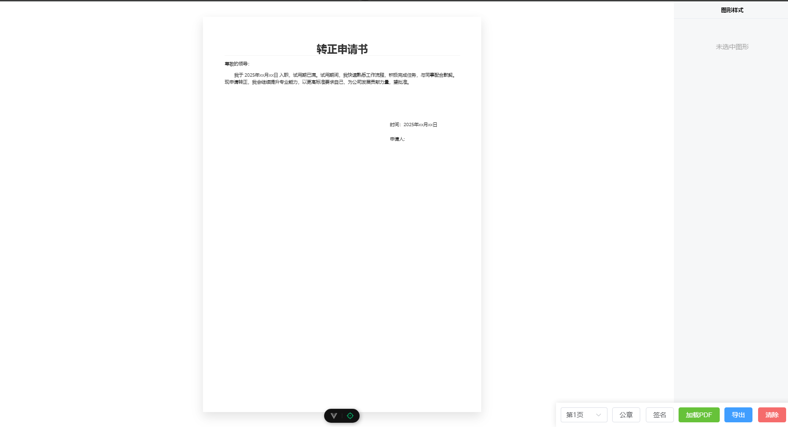
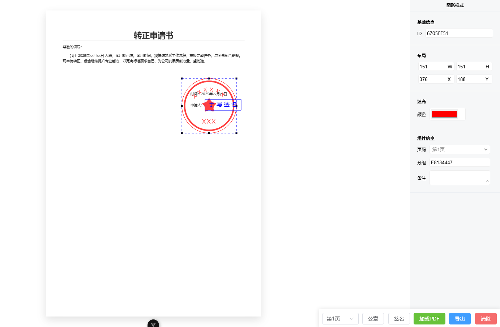

# 基于PDFJS-DIST + CANVAS的PDF模板签字盖章定位工具


## 学习开源项目

- [pdfjs-dist](https://www.npmjs.com/package/pdfjs-dist) 火狐浏览器PDF预览库
- [vue-pdf-embed](https://www.npmjs.com/package/vue-pdf-embed) 基于PDFJS-DIST的VUE组件
- [@tuttarealstep/vue-pdf.js](https://www.npmjs.com/package/@tuttarealstep/vue-pdf.js) 包含完整火狐浏览器PDF预览功能得VUE组件

## 导出数据

```json
 {
  "id": "2C1671CB", // 唯一标识符
  "endX": 515, // canvas绘制结束坐标
  "endY": 492, // canvas绘制结束坐标
  "boundingBox": true, // canvas是否显示边界框
  "boundingBoxColor": "#0000ff", // 边界框颜色
  "dragingHandleColor": "#000000", // 拖拽句柄颜色
  "startX": 364, // canvas绘制开始坐标
  "startY": 341, // canvas绘制开始坐标
  "color": "#ff0000", // 颜色
  "isFilled": true, // 是否填充
  "_type": "seal", // 类型
  "handleSize": 5, // 句柄大小
  "group": "630F14CF", // 分组
  "page": 9, // 位于pdf的页码
  "remark": "", // 备注信息
  "x": 364, //位于canvas中的x坐标
  "y": 341, // 位于canvas中的y坐标
  "pdfY": 350, // 位于pdf中的y坐标
  "pdfX": 364 // 位于pdf中的x坐标
}
```


## 预览

### 首屏加载



### PDF预览



### 添加手写签和公章


### 操作视频

[基于PDFJS-DIST + CANVAS的PDF模板签字盖章定位工具](https://www.bilibili.com/video/BV1UyoeYFEtZ/?vd_source=75530fa0c98edda53ac8b01a1084c7c8)

## 开发过程中遇到的问题

**unplugin-vue-components 插件不要忘记+s，不要写为‘unplugin-vue-component’！！**
